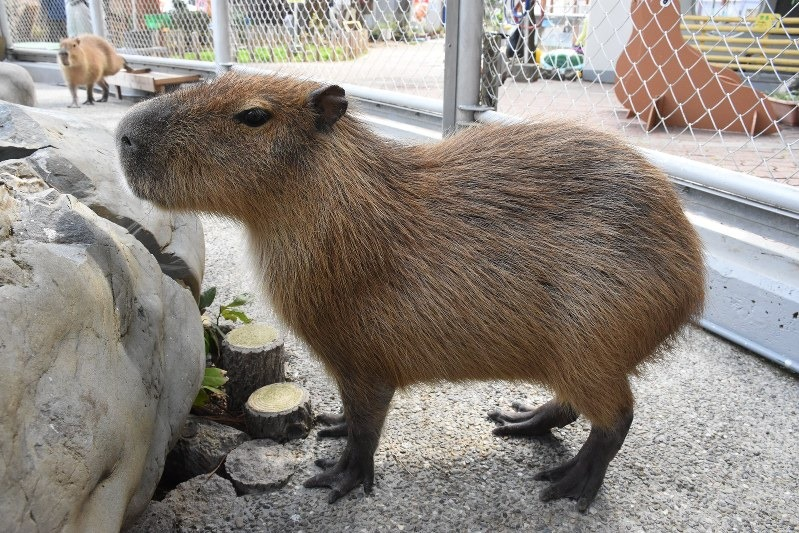

# Nagłówek

co

najmniej

trzy paragrafy

~~przekreślenie~~

**pogrubienie**

_kursywa_

> "Ala ma kota" ~ Mateusz Miotk

1. Lista
   1. Numeryczna
2. Zagnieżdżona

- Lista
- Nie Numerowana

```javascript
const string = "Javascript jest"
const string1 = "super"

console.log(`${string} ${super} ")

```

Kod programu `console.log()` zagnieżdżony w tekście


